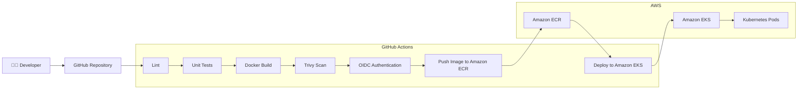
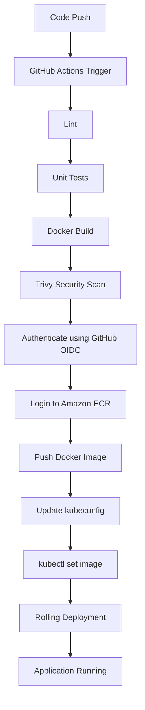
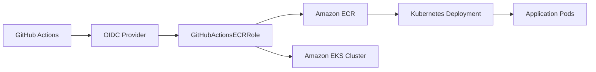

<div align="center">

# 🚀 GitHub Actions CI/CD Pipeline for Amazon EKS

### Secure, Keyless CI/CD from Code Push to Kubernetes Rolling Deployment


</div>

This project implements a **production-style CI/CD pipeline** that builds, tests, scans, and ships a containerized application to **Amazon EKS** — without a single AWS access key ever touching GitHub.

Every push to `main` triggers a fully automated pipeline that:

- ✅ Lints the application code
- ✅ Runs unit tests
- ✅ Builds the Docker image
- ✅ Scans the image for vulnerabilities with **Trivy**
- ✅ Authenticates to AWS using **GitHub OIDC** (no long-lived credentials)
- ✅ Pushes the image to **Amazon ECR**
- ✅ Updates the Kubernetes Deployment
- ✅ Performs a **rolling update** on **Amazon EKS**


  ## 🏗️ Solution Architecture



---

## 🔄 CI/CD Workflow



---

## ☁️ AWS Architecture


create a base python application

app/app.py

bash
```
from flask import Flask

app = Flask(__name__)


@app.route("/")
def home():
    return "GitHub Actions CI/CD"


if __name__ == "__main__":
    app.run(host="0.0.0.0", port=5002)
```

app/requirements.txt

bash

```
Flask==3.1.2
pytest==8.4.2
flake8==7.3.0
```

tests for python app

app/test_app.py

bash
```
from app import app


def test_home():
    client = app.test_client()
    response = client.get("/")
    assert response.status_code == 200
```

create a virtual env to run the application locally

bash
```
python3 -m venv .venv

source .venv/bin/activate

pip install -r app/requirements.txt  # installing the reuired packages to test locally
```

Run an application

bash
```
python app/app.py
```


Run tests

bash
```
cd app

pytest
```

# GitHub Actions Workflow

bash
```
mkdir -p .github/workflows
```

create pipeline script

bash
```
name: Python CI

on:
  push:
    branches:
      - main
      - develop
    paths:
      - "Usecase-17-CICD-GitHub-Actions/**"

  pull_request:
    branches:
      - main
      - develop
    paths:
      - "Usecase-17-CICD-GitHub-Actions/**"

jobs:
  test:
    runs-on: ubuntu-latest

    steps:
      - name: Checkout Repository
        uses: actions/checkout@v4

      - name: Setup Python
        uses: actions/setup-python@v5
        with:
          python-version: "3.14"

      - name: Install Dependencies
        run: |
          python -m pip install --upgrade pip
          pip install -r Usecase-17-CICD-GitHub-Actions/app/requirements.txt

      - name: Run Tests
        run: |
          cd Usecase-17-CICD-GitHub-Actions/app
          pytest
```
commit and push 


bash
```
git add Usecase-17-CICD-GitHub-Actions
git commit -m "Add Usecase-17 GitHub Actions CI/CD pipeline"
git push origin main
```


# Code Quality Pipeline

This introduces the concept of quality gates—the pipeline stops if the code doesn't meet quality standards.

Add Flake8 Linting

bash
```
pip install flake8
```
no output flake8 passed successful no issues with code


Flake8 catches:

PEP8 style violations
Unused imports
Undefined variables
Line length issues
Missing blank lines
Syntax mistakes


update the workflow


.github/workflows/usecase17-ci.yml

bash
```
name: Python CI

on:
  push:
    branches:
      - main
      - develop

  pull_request:
    branches:
      - main
      - develop
    

jobs:
  lint-and-test:
    runs-on: ubuntu-latest

    defaults:
      run:
        working-directory: Usecase-17-CICD-GitHub-Actions/app

    steps:
      - name: Checkout Repository
        uses: actions/checkout@v4

      - name: Setup Python
        uses: actions/setup-python@v5
        with:
          python-version: "3.14"

      - name: Install Dependencies
        run: |
          python -m pip install --upgrade pip
          pip install -r requirements.txt

      - name: Run Flake8
        run: |
          flake8 .

      - name: Run Tests
        run: |
          pytest
```

test the pipeline by pushing the code

bash
```
git add .github/workflows/usecase17-ci.yml
git commit -m "Add flake8 linting to CI pipeline"
git push origin main
```


# Multi-Job Pipeline

split the workflow

bash
```
name: Python CI

on:
  push:
    branches:
      - main
      - develop

  pull_request:
    branches:
      - main
      - develop

jobs:
  lint:
    name: Lint Code
    runs-on: ubuntu-latest

    defaults:
      run:
        working-directory: Usecase-17-CICD-GitHub-Actions/app

    steps:
      - name: Checkout Repository
        uses: actions/checkout@v4

      - name: Setup Python
        uses: actions/setup-python@v5
        with:
          python-version: "3.14"

      - name: Install Dependencies
        run: |
          python -m pip install --upgrade pip
          pip install -r requirements.txt

      - name: Run Flake8
        run: flake8 .

  test:
    name: Run Unit Tests
    runs-on: ubuntu-latest
    needs: lint

    defaults:
      run:
        working-directory: Usecase-17-CICD-GitHub-Actions/app

    steps:
      - name: Checkout Repository
        uses: actions/checkout@v4

      - name: Setup Python
        uses: actions/setup-python@v5
        with:
          python-version: "3.14"

      - name: Install Dependencies
        run: |
          python -m pip install --upgrade pip
          pip install -r requirements.txt

      - name: Run Tests
        run: pytest
```
needs: lint

If Lint fails, GitHub will not even start the Test job.

This is how real CI/CD pipelines enforce quality gates.

Observe the Pipeline by pushing we can see two jobs 


Deliberately Fail Lint

app/app.py

 adding os package but we are not using it
bash
```
import os
```


# Dependency Caching

Without Cache

Every workflow run starts with a fresh runner - Every push downloads everything again.

lets add cache for requirements

bash
```
- name: Setup Python
  uses: actions/setup-python@v5
  with:
    python-version: "3.14"
    cache: "pip"
    cache-dependency-path: Usecase-17-CICD-GitHub-Actions/app/requirements.txt
```

push the changes

bash
```
git add .github/workflows/usecase17-ci.yml
git commit -m "Enable pip dependency caching"
git push origin main
```


# Build a Docker Image

The goal is to automatically package the application after all quality checks pass.

bash
```
Usecase-17-CICD-GitHub-Actions/Dockerfile

FROM python:3.14-slim

WORKDIR /app

COPY app/requirements.txt .

RUN pip install --no-cache-dir -r requirements.txt

COPY app/ .

EXPOSE 5000

CMD ["python", "app.py"]
```

build and test locally

bash
```
docker build -t github-actions:v1 .
```


bash
```
docker run -d -p 5005:5002 github-actions-app:v1
```


# Continuous Delivery (CD)

Docker Security Scanning

Trivy is a vulnerability scanner from Aqua Security.

It scans:

Docker images
Filesystems
Git repositories
Kubernetes manifests
SBOMs

Severity Levels
Severity	Meaning
LOW	Minor issue
MEDIUM	Should be fixed
HIGH	Serious vulnerability
CRITICAL	Pipeline should fail

install trivy in local

bash
```
brew install trivy
```


scan our image we have built earlier

bash
```
trivy image github-actions-app:v1
```


generate a report

bash
```
trivy image \
  --format table \
  -o trivy-report.txt \
  github-actions-app:v1
```
fail the scan on vulunerabities

bash
```
trivy image \
  --severity CRITICAL \
  --exit-code 1 \
  github-actions-app:v1
```

--severity CRITICAL → only consider critical vulnerabilities.
--exit-code 1 → return a non-zero exit code if any are found.

Now add the build job to pipeline


# Integrate Trivy into GitHub Actions and push the image to ECR

bash
```
aws ecr create-repository \
  --repository-name github-actions-app \
  --image-scanning-configuration scanOnPush=true \
  --image-tag-mutability MUTABLE
```
bash
```
aws ecr describe-repositories
```


## Enable Lifecycle Policy
I don't want old images accumulating forever.


lifecycle-policy.json
bash
```
{
  "rules": [
    {
      "rulePriority": 1,
      "description": "Keep only the latest 10 images",
      "selection": {
        "tagStatus": "any",
        "countType": "imageCountMoreThan",
        "countNumber": 10
      },
      "action": {
        "type": "expire"
      }
    }
  ]
}
```

bash
```
aws ecr put-lifecycle-policy \
  --repository-name github-actions-app \
  --lifecycle-policy-text file://lifecycle-policy.json
```

## 🔑 IAM Permissions

The GitHub Actions IAM role requires:

- Amazon ECR permissions (`ecr:GetAuthorizationToken`, `ecr:BatchCheckLayerAvailability`, `ecr:PutImage`, etc.)
- `eks:DescribeCluster`

An **EKS Access Entry** granting:

```
AmazonEKSClusterAdminPolicy
```

is also required so GitHub Actions can authenticate against the Kubernetes API.

---

## 📦 Deployment Flow

```text
GitHub Push
   │
   ▼
GitHub Actions
   │
   ▼
AWS OIDC Authentication
   │
   ▼
Assume IAM Role
   │
   ▼
Docker Build
   │
   ▼
Push Image → Amazon ECR
   │
   ▼
Update kubeconfig
   │
   ▼
kubectl set image
   │
   ▼
Rolling Update
   │
   ▼
Amazon EKS
```

---
## Create the GitHub OIDC Provider

bash
```
aws iam create-open-id-connect-provider \
  --url https://token.actions.githubusercontent.com \
  --client-id-list sts.amazonaws.com \
  --thumbprint-list 6938fd4d98bab03faadb97b34396831e3780aea1

  aws iam list-open-id-connect-providers
```


creating a trust policy and  IAM role

bash
```
{
  "Version": "2012-10-17",
  "Statement": [
    {
      "Effect": "Allow",
      "Principal": {
        "Federated": "arn:aws:iam::497508796460:oidc-provider/token.actions.githubusercontent.com"
      },
      "Action": "sts:AssumeRoleWithWebIdentity",
      "Condition": {
        "StringEquals": {
          "token.actions.githubusercontent.com:aud": "sts.amazonaws.com"
        },
        "StringLike": {
          "token.actions.githubusercontent.com:sub": "repo:kornurabindranath-ctrl/Devops:*"
        }
      }
    }
  ]
}
```

bash
```
aws iam create-role \
  --role-name GitHubActionsECRRole \
  --assume-role-policy-document file://trust-policy.json
```

## Attach ECR Permissions

bash
```
aws iam attach-role-policy \
  --role-name GitHubActionsECRRole \
  --policy-arn arn:aws:iam::aws:policy/AmazonEC2ContainerRegistryPowerUser


  aws iam get-role \
  --role-name GitHubActionsECRRole # verify 
```

## Add GitHub Workflow Permissions

bash
```
permissions:
  id-token: write
  contents: read
```

This allows GitHub Actions to request an OIDC token.

## Configure Repository Variables


now update the pipeline script with build scan and psuh to ECR

bash
```
docker:
  name: Build, Scan and Push
  runs-on: ubuntu-latest
  needs: test

  steps:
    - name: Checkout Repository
      uses: actions/checkout@v4

    - name: Configure AWS Credentials
      uses: aws-actions/configure-aws-credentials@v4
      with:
        role-to-assume: ${{ vars.AWS_ROLE_ARN }}
        aws-region: ${{ vars.AWS_REGION }}

    - name: Login to Amazon ECR
      id: login-ecr
      uses: aws-actions/amazon-ecr-login@v2

    - name: Build Docker Image
      run: |
        docker build \
          -t github-actions-app:${{ github.sha }} \
          ./Usecase-17-CICD-GitHub-Actions

    - name: Scan Docker Image
      uses: aquasecurity/trivy-action@0.33.1
      with:
        image-ref: github-actions-app:${{ github.sha }}
        format: table
        severity: CRITICAL
        exit-code: 1

    - name: Tag Docker Image
      run: |
        docker tag github-actions-app:${{ github.sha }} \
        ${{ steps.login-ecr.outputs.registry }}/${{ vars.ECR_REPOSITORY }}:${{ github.sha }}

    - name: Push Docker Image
      run: |
        docker push \
        ${{ steps.login-ecr.outputs.registry }}/${{ vars.ECR_REPOSITORY }}:${{ github.sha }}
```

commit and push

bash
```
git add .
git commit -m "Add Docker build, Trivy scan and ECR push"
git push origin main
```


not able to push the image because it has vulnerabailities

lets chnage exit-code: 0 so we can psuh the image to ECR


## Continuous Deployment (CD) to Amazon EKS

Create an EKS cluster

bash
```
eksctl create cluster \
  --name github-actions-lab \
  --region us-east-1 \
  --nodes 2 \
  --node-type t3.medium
```


lets create deployment

bash
```
apiVersion: apps/v1
kind: Deployment
metadata:
  name: github-actions-app
spec:
  replicas: 2
  selector:
    matchLabels:
      app: github-actions-app

  template:
    metadata:
      labels:
        app: github-actions-app

    spec:
      containers:
      - name: github-actions-app
        image: 497508796460.dkr.ecr.us-east-1.amazonaws.com/github-actions-app:latest

        ports:
        - containerPort: 5000

        imagePullPolicy: Always
```

service 

bash
```
apiVersion: v1
kind: Service
metadata:
  name: github-actions-app-service

spec:
  selector:
    app: github-actions-app

  ports:
  - port: 80
    targetPort: 5000

  type: LoadBalancer
```


now add deploy job to yaml

bash
```
deploy:
  name: Deploy to Amazon EKS
  runs-on: ubuntu-latest
  needs: docker

  steps:
    - name: Checkout Repository
      uses: actions/checkout@v4

    - name: Configure AWS Credentials
      uses: aws-actions/configure-aws-credentials@v4
      with:
        role-to-assume: ${{ vars.AWS_ROLE_ARN }}
        aws-region: ${{ vars.AWS_REGION }}

    - name: Update kubeconfig
      run: |
        aws eks update-kubeconfig \
          --region ${{ vars.AWS_REGION }} \
          --name ${{ vars.EKS_CLUSTER_NAME }}

    -- name: Update Deployment Image
  run: |
    kubectl set image deployment/github-actions-app \
      github-actions-app=497508796460.dkr.ecr.us-east-1.amazonaws.com/${{ vars.ECR_REPOSITORY }}:${{ github.sha }}

    - name: Verify Rollout
      run: |
        kubectl rollout status deployment/github-actions-app
```
push and commit

bash
```
git add .                           
git commit -m "deployiong to EKS"    
git push origin main  
```


the role cannot describe the EKS cluster.

we need add permissions

bash
```
{
  "Version": "2012-10-17",
  "Statement": [
    {
      "Sid": "ECRPermissions",
      "Effect": "Allow",
      "Action": [
        "ecr:GetAuthorizationToken",
        "ecr:BatchCheckLayerAvailability",
        "ecr:BatchGetImage",
        "ecr:CompleteLayerUpload",
        "ecr:GetDownloadUrlForLayer",
        "ecr:InitiateLayerUpload",
        "ecr:PutImage",
        "ecr:UploadLayerPart"
      ],
      "Resource": "*"
    },
    {
      "Sid": "EKSDescribeCluster",
      "Effect": "Allow",
      "Action": [
        "eks:DescribeCluster"
      ],
      "Resource": "arn:aws:eks:us-east-1:497508796460:cluster/github-actions-lab"
    }
  ]
}


```

Attach it to the IAM role

bash
```

aws iam put-role-policy \
  --role-name GitHubActionsECRRole \
  --policy-name GitHubActionsEKSPolicy \
  --policy-document file://github-actions-eks-policy.json


  aws iam list-role-policies \
  --role-name GitHubActionsECRRole  # verify
```

verfiy access entry 

bash
```
aws eks list-access-entries \
  --cluster-name github-actions-lab \
  --region us-east-1
```

verfiy the polices

bash
```
aws eks list-associated-access-policies \
  --cluster-name github-actions-lab \
  --principal-arn arn:aws:iam::497508796460:role/GitHubActionsECRRole \
  --region us-east-1
```

now push and commit

bash
```
git add .                           
git commit -m "deployiong to EKS"    
git push origin main  
```


## 📊 Key Features

- ✅ Production-ready CI/CD
- ✅ Secure AWS authentication using OIDC
- ✅ Automated Docker builds
- ✅ Vulnerability scanning before deployment
- ✅ Continuous deployment to Amazon EKS
- ✅ Zero AWS access keys stored in GitHub
- ✅ Rolling deployments with no downtime
- ✅ Infrastructure following AWS best practices


Successfully implemented a secure, production-style GitHub Actions CI/CD pipeline that automatically builds, scans, and deploys containerized applications to Amazon EKS — using OIDC-based authentication, Amazon ECR, Kubernetes rolling deployments, and Trivy vulnerability scanning, with zero long-lived AWS credentials anywhere in the pipeline.
